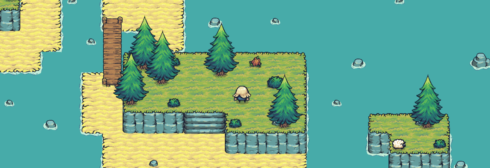

# SaveSheepIland

Le but de ce projet etait de faire une maquette pour decouvrir Godot.
Decouvrir plusieurs outils de ce logiciel pour avoir un petit aperçu de ce que je pouvais raisonnablement faire. A la suite de ce step je pourrai imaginer faire un jeu un peu plus abouti.

Je me suis appuyé sur le visiuel créée par [Pixelfrog](https://pixelfrog-assets.itch.io/tiny-swords) appelé Tiny Swords.

J'ai donc eplorer:
- creation de map
- collision
- mouvement du joueur
- UI
- couper du bois
- construction

-> [video](https://drive.google.com/file/d/1BPDY2-SyTRq-85Y-guj8reXzWyXcz88Y/view?usp=sharing)

---

Simon P
